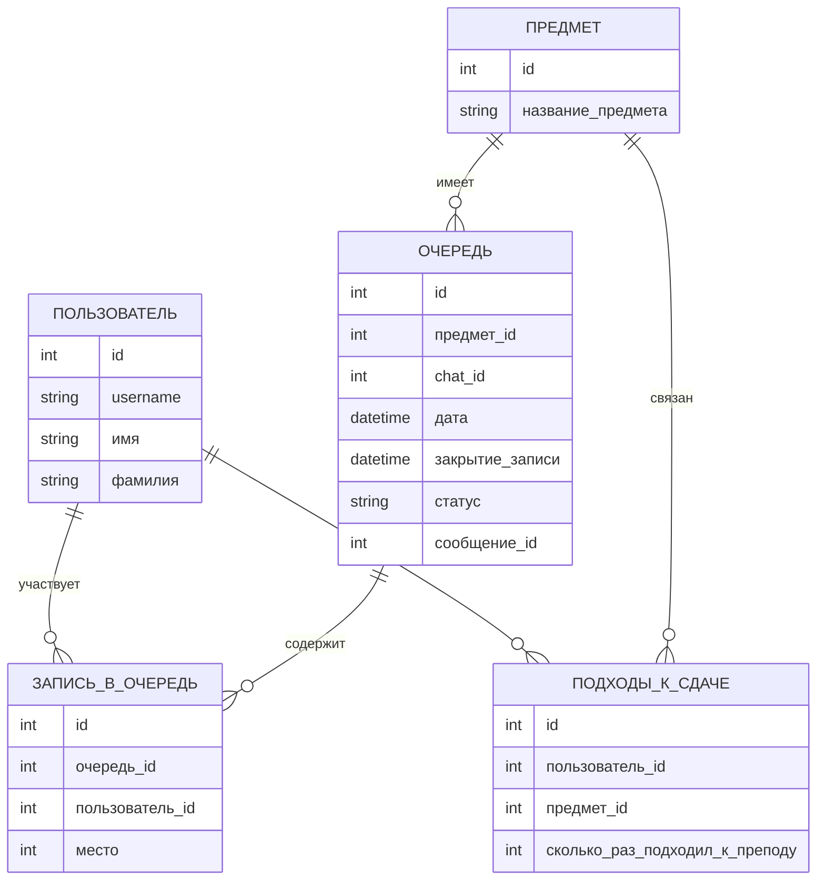

## Роли

- **Админ**: создаёт очереди, закрывает их, может перемешивать участников.
- **Студент**: записывается на лабораторную через бота, видит своё место в очереди

# Диаграмма БД:

```mermaid
erDiagram
    USER ||--o{ QUEUE_ENTRY : participates
    QUEUE ||--o{ QUEUE_ENTRY : contains
    USER ||--o{ SUBMISSION_ATTEMPT : makes
    SUBJECT ||--o{ QUEUE : has
    SUBJECT ||--o{ SUBMISSION_ATTEMPT : related_to
    USER ||--o{ USERGENERAL : has
    USERGENERAL ||--o{PAY 

    USER {
        int id
        string username
        string first_name
        string last_name
    }
    USERGENERAL {
        int id
        int user_id
    }
    QUEUE {
        int id
        int subject_id
        int chat_id
        datetime date
        datetime close_at
        string status
        int message_id
    }
    QUEUE_ENTRY {
        int id
        int queue_id
        int user_id
        int position
    }
    SUBMISSION_ATTEMPT {
        int id
        int user_id
        int subject_id
        int attempts_count
    }
    SUBJECT {
        int id
        string name
    }
    PAY {
        int id
        int user_id
        bool status
        datetime data_pay
        datetime date_end
    }

```

# Диаграмма БД на русском:


