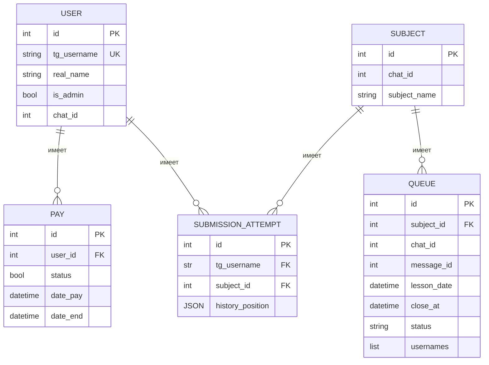

## Роли

- **Админ**: создаёт очереди, закрывает их, может перемешивать участников.
- **Студент**: записывается на лабораторную через бота, видит своё место в очереди

# Диаграмма БД:

```mermaid
erDiagram
    USER ||--o{ SUBMISSION_ATTEMPT : имеет
    USER ||--o{ PAY : имеет
    SUBJECT ||--o{ QUEUE : имеет
    SUBJECT ||--o{ SUBMISSION_ATTEMPT : имеет

    USER {
        int id PK
        string tg_username UK
        string real_name
        bool is_admin
        int chat_id
    }
    SUBJECT {
        int id PK
        int chat_id
        string subject_name
    }
    QUEUE {
        int id PK
        int subject_id FK
        int chat_id
        int message_id
        datetime lesson_date
        datetime close_at
        string status
        list usernames
    }
    SUBMISSION_ATTEMPT {
        int id PK
        str tg_username FK
        int subject_id FK
        JSON history_position
    }
    PAY {
        int id PK
        int user_id FK
        bool status
        datetime date_pay
        datetime date_end
    }


```
