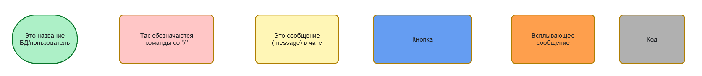
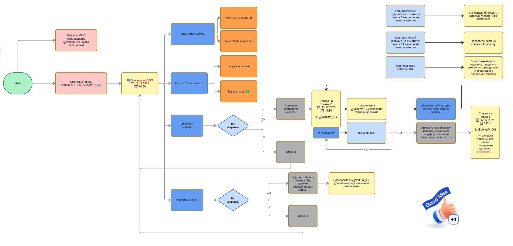
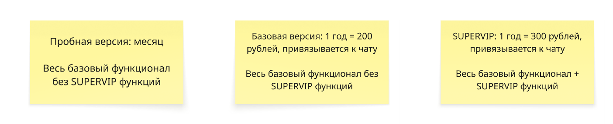
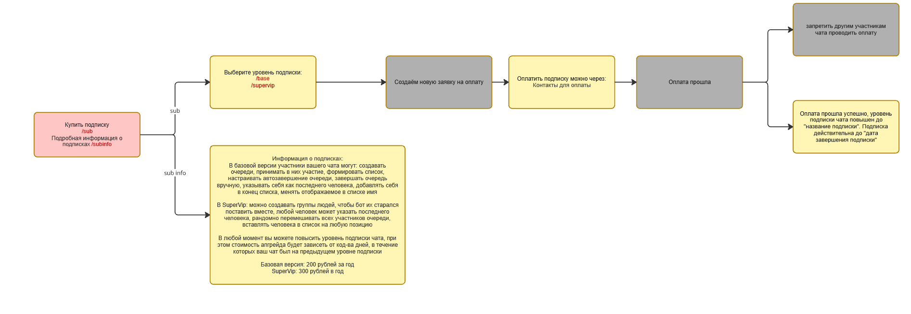
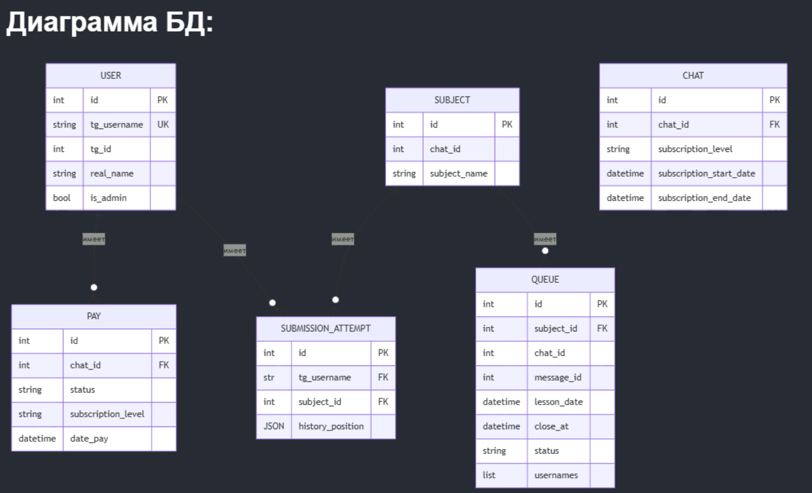

# Техническое задание  
**Проект: FairLabQueue Bot**  
Telegram-бот для справедливого управления очередями на сдачу лабораторных / практических работ

## 1. Общие сведения

### Название проекта
FairLabQueue Bot

### Цель проекта
Создать удобный Telegram-бот, который автоматизирует запись студентов в очередь на сдачу лабораторных/практических работ, минимизирует ручное управление очередями и обеспечивает **справедливое** распределение мест с учётом истории предыдущих попыток.

### Основные роли пользователей

| Роль              | Кто это                          | Основные права                                                                 |
|-------------------|----------------------------------|---------------------------------------------------------------------------------|
| Участник (студент)| Любой пользователь в чате        | Записаться / отменить запись, посмотреть свою позицию и историю по предмету    |
| Администратор     | Преподаватель / ассистент / староста | Создавать, закрывать, удалять очереди, отмечать «успел/не успел», управлять списком админов |
| SuperAdmin        | Владелец бота / администраторы  | Всё выше + добавлять/удалять администраторов, глобальные настройки            |

### Предполагаемая нагрузка
- До 30 одновременных активных пользователей в одном чате  
- До 5–7 активных очередей одновременно в одном чате  
- Пиковая нагрузка — первые 1–3 минуты после открытия очереди

## 2. Обязательный функционал MVP

### Основной сценарий «Студент»

1. Админ создаёт очередь командой  
   `/queue "ООП" 05.04.2026 16:00`  
   → бот публикует сообщение с inline-кнопками

2. Студент нажимает кнопку **«✅ Записаться»**  
   → занимает место в очереди

3. Студент видит свою текущую позицию в очереди

4. Студент может в любой момент нажать **«❌ Отменить»** → место освобождается, остальные сдвигаются

### Основной сценарий «Администратор»

- Создать очередь → `/queue "Название" ДД.ММ.ГГГГ ЧЧ:ММ`  
- Закрыть очередь досрочно → кнопка «Завершить приём»  
- Отметить «последнего сдавшего» → кнопка «Я последний, кто успел» 
  - все, кто остался после этой отметки, получают +1 в счётчик «не успел»  
- Сформировать итоговый список → кнопка «Финализировать очередь»  
- Удалить очередь полностью → кнопка «Удалить очередь» (с подтверждением)

### Справедливая сортировка

- `attempts_count` — общее количество попыток по этому предмету  
- `missed_count` — сколько раз человек не успел / был после «последнего»  
- `avg_position` — средняя позиция по всем предыдущим попыткам (чем меньше — тем лучше)
- рандомизация оставшихся

### Команды и кнопки

**Команды для всех:**
- `/start` — приветствие и краткая справка
- `/queue "Предмет" ДД.ММ.ГГГГ ЧЧ:ММ` — создать очередь
- `/last @user_id <предмет дата время>` - Вручную установить последнего сдавшего 
- `/sub` - Купить подписку
- `/subinfo` - Подробная информация о подписках 
- `/help` - Информация о доступных командах
- `/changename @username Имя Фамилия` - изменить отображаемый tg_username в очереди

## 3. Нефункциональные требования

- Язык: Python 3.11+
- Фреймворк: aiogram 3.x
- База данных: SQLite (файл app.db) + SQLAlchemy ORM
- Хранение токена и настроек: .env
- Логирование: python logging, настраиваемый уровень (INFO по умолчанию)
- Код: PEP 8, type hints, модульная структура

## 4. Структура базы данных

| Таблица              | Поля                                                                                   |
|----------------------|----------------------------------------------------------------------------------------|
| users                | id (PK, Telegram user_id) username real_name is_super_admin                  |
| chats                | id (PK) chat_id (UK, Telegram chat id) title subscription_level subscription_end |
| pay                  | id (PK) chat_id (FK) user_id (FK) status date_pay date_end             |
| subjects             | id (PK) chat_id (FK) name                                                        |
| subject_admins       | subject_id (FK) user_id (FK) added_at (составной PK: subject_id + user_id)    |
| queues               | id (PK) subject_id (FK) chat_id (FK) message_id lesson_date lesson_time created_at closed_at status |
| queue_participants   | queue_id (FK) user_id (FK) position joined_at cancelled_at (составной PK: queue_id + user_id) |
| submission_attempts  | id (PK) user_id (FK) subject_id (FK) queue_id (FK) position result attempted_at |

## 5. Модель монетизации

### Общая концепция
- Бот работает по freemium-модели: базовый функционал доступен бесплатно в течение 1 месяца.
- Платные тарифы дают расширенный функционал после окончания пробного периода
- Все платные подписки привязываются **к чату**, а не к конкретному пользователю.
- Оплата производится через **ЮKassa** (ЮMoney).
- Поддерживаются только годовые подписки.

### Тарифы

| Тариф          | Стоимость          | Длительность | Привязка     | Доступные функции                                                                 | 
|----------------|--------------------|--------------|--------------|------------------------------------------------------------------------------------|
| Пробная версия | 0 ₽                | 30 дней      | к чату       | Весь базовый функционал (без SUPERVIP-фич)                                         |
| Базовая        | 200 ₽              | 1 год        | к чату       | Весь базовый функционал (без SUPERVIP-фич)                                         | 
| SUPERVIP       | 300 ₽              | 1 год        | к чату       | Весь базовый функционал + все SUPERVIP-функции                                     | 

### Что входит в «Базовый функционал»

- Создание и управление очередями
- Запись / отмена записи студентов
- Просмотр текущей позиции и списка очереди
- История попыток по предмету для каждого пользователя
- Справедливая сортировка (по алгоритму приоритета)
- Отметка «успел / не успел»
- Финализация очереди и сохранение результатов

### SUPERVIP-функции (только в тарифе SUPERVIP)

- Уведомления участникам о приближении их очереди (за 10 мин, за 1 мин и т.п.)
- Возможность добавления «приоритетных» студентов в выбранное место текущей очереди 

### Механика пробного периода

- При первом запуске бота в новом чате автоматически активируется **30-дневный пробный период** (тариф Пробная версия).
- После окончания пробного периода бот ожидает оплату, функционал бота становится недоступен для этого чата.

### Техническая реализация оплаты (ЮKassa)

- Интеграция через **ЮKassa API**.
- После успешной оплаты бот:
  - присваивает чату нужный тариф и дату окончания подписки
  - сохраняет информацию в таблице `pay`
  - обновляет поле `subscription_level` и `subscription_end` в таблице `chats`
- Ежедневный cron проверяет истёкшие подписки и переводит чаты в бесплатный режим.
- Команда `/subscribe` — показывает текущий статус подписки чата + кнопки для оплаты (генерация платёжной ссылки ЮKassa).

## 6. Критерии приёмки

- Бот успешно запускается и отвечает на /start
- Создание → запись → отмена → закрытие очереди работает без ошибок
- История попыток сохраняется и отображается корректно
- Алгоритм приоритета даёт корректный результат
- Все сообщения и кнопки на русском языке
- README с инструкцией по запуску и настройке .env

## Приложение. Miro схемы

Рисунок 1. Легенда обозначения блоков схем

Рисунок 2. Общая структура сервиса

Рисунок 3. Тарифные планы

Рисунок 4. Схема обработки оплаты

Рисунок 5. Схема Базы данных